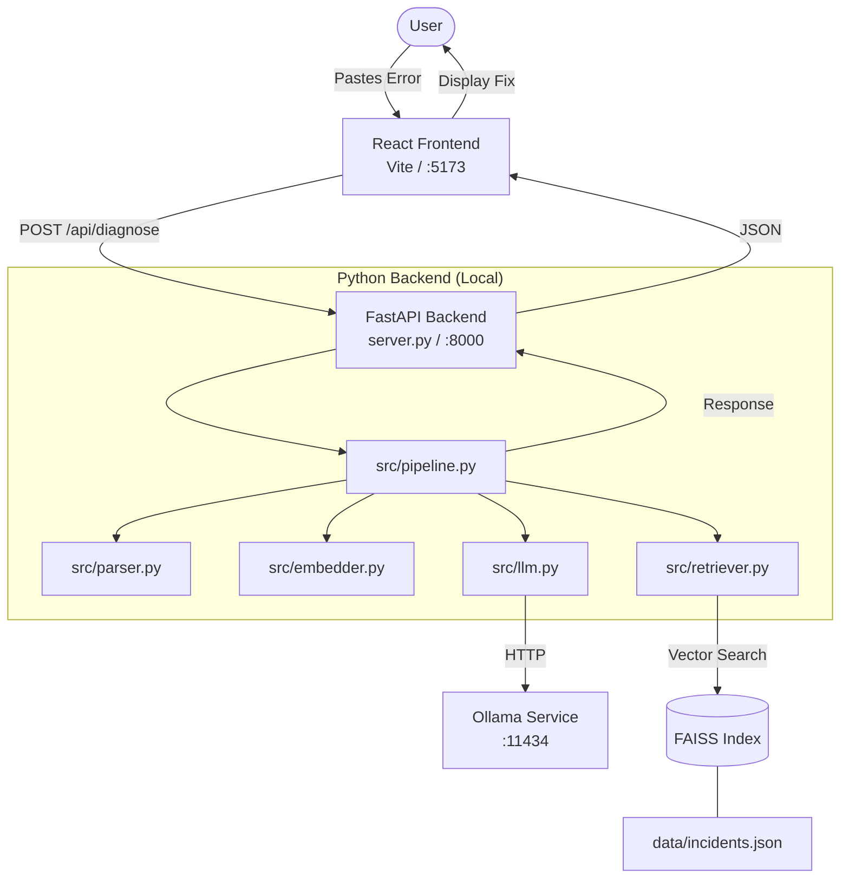
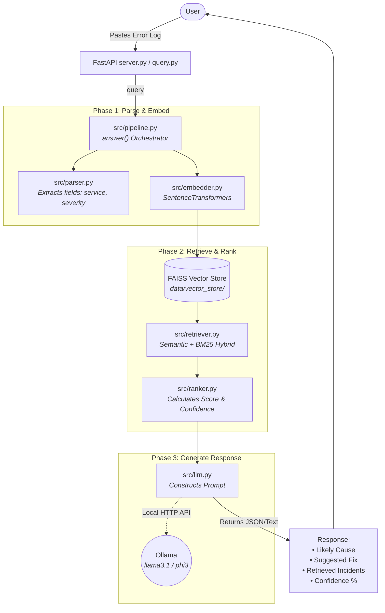

# Context-Aware Incident Debugging Assistant

A **fully local RAG system** that takes an error/log snippet and returns the likely root cause + fix steps, retrieved from past incidents (and later: docs, runbooks, chats).

- 🔒 **100% local** — no API keys, no data leaves your machine
- 🧠 **Local LLM** via Ollama (Llama 3.1 / Mistral / Qwen / Phi-3)
- 🔍 **Local embeddings** via SentenceTransformers
- 📦 **Local vector DB** via FAISS

---

## 🗺️ Architecture flow

### High-level: how a query flows through the system



### Detailed Logic Flow



### Index-build flow (run once, then again whenever you add incidents)

```
data/incidents.json
        │
        ▼
src/loader.py        → flattens each incident to "Error: ... \n Root Cause: ... \n Fix: ..."
        │
        ▼
src/embedder.py      → SentenceTransformers(all-MiniLM-L6-v2)  → 384-dim vectors
        │
        ▼
src/vector_store.py  → FAISS IndexFlatL2  →  data/vector_store/{index.faiss, metadata.json}
```

### Where the local processes live

```
        Your Windows machine
┌──────────────────────────────────────────────────┐
│                                                  │
│  Python process (your code)                      │
│  ├── SentenceTransformers (in-process, CPU/GPU)  │
│  ├── FAISS (in-process, RAM)                     │
│  └── HTTP client  ─────────┐                     │
│                            │                     │
│                            ▼                     │
│  Ollama service (background, port 11434)         │
│  └── Llama 3.1 8B (or phi3:mini, etc.)           │
│                                                  │
└──────────────────────────────────────────────────┘
        No external network calls.
```

---

## 📁 Project layout

```text
LocalPulse/
├── config.py                 # Central configuration (reads .env)
├── requirements.txt          # Python dependencies
├── .env.example              # Template for environment variables
├── data/
│   ├── incidents.json        # Knowledge base dataset
│   └── vector_store/         # FAISS indices generated by build_index.py
├── src/
│   ├── loader.py             # Loads and formats incident data
│   ├── embedder.py           # Generates SentenceTransformers embeddings
│   ├── vector_store.py       # Manages FAISS vector database
│   ├── retriever.py          # Hybrid (BM25 + Semantic) retrieval
│   ├── llm.py                # LLM generation wrapper (Ollama/OpenAI)
│   ├── parser.py             # Parses raw logs into structured fields
│   ├── ranker.py             # Ranks retrieved results with confidence
│   └── pipeline.py           # Main RAG orchestration pipeline
├── scripts/
│   ├── build_index.py        # CLI script to embed and index incidents
│   └── query.py              # CLI script to test queries
├── server.py                 # FastAPI backend server
├── app.py                    # Streamlit UI (Legacy)
└── frontend/                 # React + Vite UI frontend
```


---

## 🛠️ Installation (step-by-step)

### Step 1 — Install Ollama (local LLM runtime)

1. Download the Windows installer: **https://ollama.com/download**
2. Run the installer. It registers Ollama as a background service on `http://localhost:11434`.
3. Verify it's running — open PowerShell:
   ```powershell
   ollama --version
   ```

### Step 2 — Pull a model

Pick **one** model based on your hardware. RAM/VRAM is the bottleneck.

| Model              | Size    | Min RAM | Best for                            |
|--------------------|---------|---------|-------------------------------------|
| `llama3.1:8b`      | ~4.7 GB | 8 GB    | **Default — best general quality**  |
| `qwen2.5:7b`       | ~4.4 GB | 8 GB    | Strong at code & reasoning          |
| `mistral:7b`       | ~4.1 GB | 8 GB    | Fast, solid all-rounder             |
| `phi3:mini`        | ~2.3 GB | 4 GB    | **Weak hardware / no GPU**          |
| `qwen2.5:1.5b`     | ~1 GB   | 2 GB    | Tiny, fastest, lower quality        |

```powershell
ollama pull llama3.1:8b
```

This downloads once (a few GB). Verify:
```powershell
ollama list
ollama run llama3.1:8b "hello, say one short sentence"
```

If `ollama run` returns a reply, the local LLM is ready.

> **GPU note:** Ollama auto-detects NVIDIA GPUs (with CUDA) and AMD GPUs (with ROCm on supported cards). On CPU-only laptops, smaller models (`phi3:mini`, `qwen2.5:1.5b`) feel much better.

### Step 3 — Python environment

```powershell
cd d:\AI
python -m venv .venv
.\.venv\Scripts\Activate.ps1
pip install -r requirements.txt
```

The first install pulls `sentence-transformers` and `faiss-cpu` — total ~500 MB.

### Step 4 — Configure `.env`

```powershell
copy .env.example .env
```

The defaults are already set for fully local mode:
```
LLM_PROVIDER=ollama
LLM_MODEL=llama3.1:8b
OLLAMA_HOST=http://localhost:11434
EMBEDDING_PROVIDER=sentence-transformers
EMBEDDING_MODEL=all-MiniLM-L6-v2
```

If you pulled a different Ollama model in Step 2, update `LLM_MODEL` to match (e.g. `phi3:mini`).

### Step 5 — Build the vector index

```powershell
python scripts/build_index.py
```

Expected output:
```
Indexed 12 incidents.
```

This creates `data/vector_store/index.faiss` and `data/vector_store/metadata.json`.
Re-run this whenever you edit `data/incidents.json`.

### Step 6 — Run a query

```powershell
python scripts/query.py "NullPointerException in payment service line 45"
```

Expected output:
```
=== Retrieved Incidents ===
  [INC-001] NullPointerException in PaymentService at processPayment line 45  (dist=0.312)
  [INC-008] Duplicate key violation on orders_pkey during checkout retry      (dist=0.842)
  ...

=== Answer ===
Likely Cause: User object was likely null when payment was triggered...
Suggested Fix:
- Add null validation for user before processing payment
- ...
```

## 🚀 Running the Application

Follow these steps once you have completed the installation.

### 1. Ollama
Ollama should be running in the background. It loads the model automatically on the first request.
Verify with: `ollama list`

### 2. Start Backend (Terminal 1)
```powershell
# From project root
.\.venv\Scripts\Activate.ps1
python server.py
```
The API will be available at `http://localhost:8000`.

### 3. Start Frontend (Terminal 2)
```powershell
cd frontend
npm install  # (First time only)
npm run dev
```

### 4. Open in Browser
Visit **[http://localhost:5173](http://localhost:5173)** to start debugging!

---

## 🚦 Phase roadmap

Build phases in order — each one stands on the previous.

| Phase | Goal                                          | Files involved                                                       | Status      |
|-------|-----------------------------------------------|----------------------------------------------------------------------|-------------|
| 0     | Scope + seed dataset                          | `data/incidents.json`                                                | ✅ done      |
| 1     | Working RAG: query → retrieve → answer        | `loader`, `embedder`, `vector_store`, `retriever`, `llm`, `pipeline` | ✅ done      |
| 2     | Hybrid retrieval (BM25 + semantic), weighting | `retriever.HybridRetriever`                                          | ✅ done      |
| 3     | Log parsing → structured fields               | `parser`                                                             | ✅ done      |
| 4     | Ranking + confidence score                    | `ranker`                                                             | ✅ done      |
| 5     | Multi-source: runbooks, fake Slack, docs      | extend `loader` + `vector_store`                                     | 🔲 next      |
| 6     | Streamlit UI                                  | `app.py`                                                             | ✅ done      |
| 7     | Evaluation: retrieval accuracy, top-k success | `eval/evaluate.py`                                                   | ✅ done      |

---

## 🆘 Troubleshooting

**`ollama: command not found`**
The installer didn't add Ollama to PATH. Restart PowerShell, or run from `C:\Users\<you>\AppData\Local\Programs\Ollama\ollama.exe`.

**`ConnectionError: localhost:11434`**
Ollama service isn't running. Start it from the Start Menu (search "Ollama"), or run `ollama serve` in a separate terminal.

**`pip install` fails on `faiss-cpu`**
Make sure you're on Python 3.10–3.12 (3.13 is too new for some wheels). Check with `python --version`.

**Query returns nonsense / hallucinates**
The 8B model is small. Try `qwen2.5:7b` (better at code) or move to a larger model like `llama3.1:70b` if you have 40+ GB RAM.

**Out of memory while running model**
Switch to `phi3:mini` in `.env` (`LLM_MODEL=phi3:mini`) — runs on 4 GB RAM.

**Want cloud LLMs instead?**
In `.env`, set `LLM_PROVIDER=openai` and `OPENAI_API_KEY=sk-...`, or `LLM_PROVIDER=anthropic` and `ANTHROPIC_API_KEY=sk-ant-...`. The code already handles all three.
